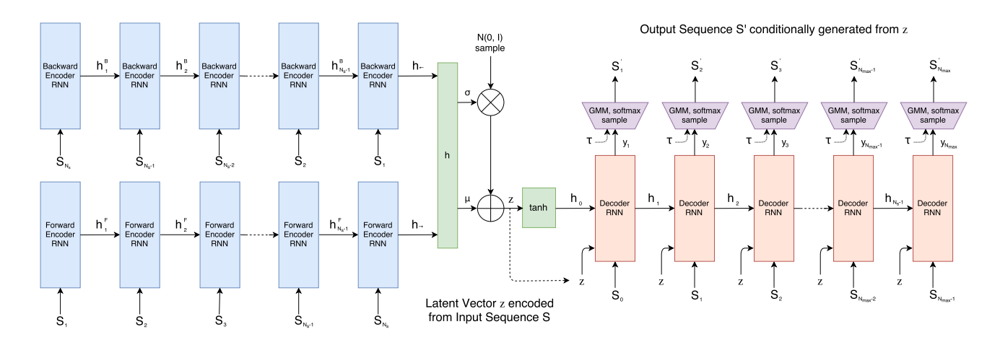

# Neural Doodle Generation

### Overview 
This project takes a string and transforms it into an image using deep learning

### Details

We take an input string and embed it as a vector using pretrained word embeddings. For this use case, we are using [fasttext embeddings](https://fasttext.cc/docs/en/english-vectors.html) trained on Wikipedia. Fasttext improves on earlier work on word representations by learning character level information represented as a bag of character n-grams.

After we have the embedding for our input string we compare it to embeddings for each of the classes in the [Google Quickdraw dataset](https://quickdraw.withgoogle.com/data). The Quickdraw dataset has 340 classes of doodles drawn by people from all over the world. They consist of basic objects like face or airplane. The metric we use to compare these embeddings is [cosine similarity](https://en.wikipedia.org/wiki/Cosine_similarity) which is computed by measuring the cosine of the angle between two non-zero vectors of an inner product space. The class with the highest cosine similarity with the input string is then chosen. 

Diagram of embedding the input string

The model generates its own sketches of the chosen class using a variational autoencoder (VAE) proposed by [Ha et al, 2017](https://arxiv.org/pdf/1704.03477.pdf). The VAE model is composed of an encoder and a decoder. The encoder portion is a bidirectional LSTM network that outputs a mean and std vector that is combined with a standard normal to create a latent vector. The decoder portion is an autoregressive RNN that generates outputs conditional on the given latent vector.

Model diagram from A Neural Representation of Sketch Drawings by Ha et al.

After generating doodles, we can render them in the style of other paintings/pictures using a [neural style transfer](https://arxiv.org/abs/1508.06576) model.

### References
- [Enriching Word Vectors with Subword Information](https://arxiv.org/pdf/1607.04606.pdf)
- [A Neural Representation of Sketch Drawings](https://arxiv.org/pdf/1704.03477.pdf)
- [Auto-Encoding Variational Bayes](https://arxiv.org/pdf/1312.6114.pdf)
- [A Neural Algorithm of Artistic Style](https://arxiv.org/pdf/1508.06576.pdf)
- [Arbitrary Style Transfer in Real-time with Adaptive Instance Normalization](https://arxiv.org/pdf/1703.06868.pdf)
