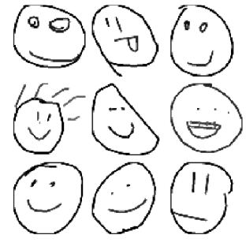

# Neural Doodle Generation

Turn your text into abstract art with noodle generation!
Go from the text of your choice to trippy doodles generated by neural networks.

### Setup
All relevant dependencies are outlined in the `requirements.txt` file.
You can install all of them by running

`pip install -r requirements.txt`

It is recommended to run this in a **virtual environment** to preserve the state of your local environment.

After installing dependencies you can run the project with the `run.sh` script. The script will complete the following steps:

1. Download and process the pretrained word embeddings (fasttext).
2. Ask for an input string, find the closest Quickdraw class and download it. 
3. Train the sketch model on the doodles from the Quickdraw class and generate new ones.
4. Download the pretrained style transfer model.
5. Render the generated doodles in the style of the sample image and stitch them together.

The final generated image will be saved in the assets folder.

### Technical Details

We take an input string and embed it as a vector using pretrained word embeddings. For this project, we are using [fasttext embeddings](https://fasttext.cc/docs/en/english-vectors.html) trained on Wikipedia. Fasttext improves on earlier work on word representations by learning character level information represented as a bag of character n-grams.

After we have the embedding for our input string we compare it to embeddings for each of the classes in the [Google Quickdraw dataset](https://quickdraw.withgoogle.com/data). The Quickdraw dataset has 340 classes of doodles drawn by people from all over the world. They consist of basic objects like face or airplane. The metric we use to compare these embeddings is [cosine similarity](https://en.wikipedia.org/wiki/Cosine_similarity) which is computed by measuring the cosine of the angle between two non-zero vectors of an inner product space. In this case, the non-zero vectors are those of the input string and the Quickdraw classes. The class with the highest cosine similarity with the input string is then chosen. 

Diagram of embedding the input string

A model generates its own sketches of the chosen class using a variational autoencoder (VAE) proposed by [Ha et al, 2017](https://arxiv.org/pdf/1704.03477.pdf). Images from the dataset are fed into the model as it learns the distribution of these images. The VAE model is composed of an encoder and a decoder. The encoder portion is a bidirectional LSTM network that outputs a mean and std vector that is combined with a standard normal to create a latent vector. The decoder portion is an autoregressive RNN that generates outputs conditional on the aforementioned latent vector.

Model diagram from A Neural Representation of Sketch Drawings by Ha et al.

Doodles generated by the VAE model

Once we have generated doodles, we render them in the style of other paintings/pictures using a [style transfer](https://arxiv.org/abs/1508.06576) model. The original neural style transfer paper used an ImageNet trained VGG-19 model. The implementation here is the more computationally efficient arbitrary style transfer as proposed in [Huang et al](https://arxiv.org/pdf/1703.06868.pdf)'s paper. After encoding the content and style images with the VGG model, an adaptive instance normalization (AdaIN) layer is used to perform style transfer. This is then passed to another decoder network that learns to invert the output of the AdaIN layer. The same encoder is used for calculating the loss which is the sum of separate content and style losses weighted by a lambda parameter.

Diagram of the arbitrary style transfer algorithm from Arbitrary Style Transfer in Real-time with Adaptive Instance Normalization

An example of the final render is shown below.

Style transfer with generated doodles

### References
- [Enriching Word Vectors with Subword Information](https://arxiv.org/pdf/1607.04606.pdf)
- [A Neural Representation of Sketch Drawings](https://arxiv.org/pdf/1704.03477.pdf)
- [Auto-Encoding Variational Bayes](https://arxiv.org/pdf/1312.6114.pdf)
- [A Neural Algorithm of Artistic Style](https://arxiv.org/pdf/1508.06576.pdf)
- [Arbitrary Style Transfer in Real-time with Adaptive Instance Normalization](https://arxiv.org/pdf/1703.06868.pdf)
- [Deep CORAL: Correlation Alignment for Deep Domain Adaptation](https://arxiv.org/pdf/1607.01719.pdf)
